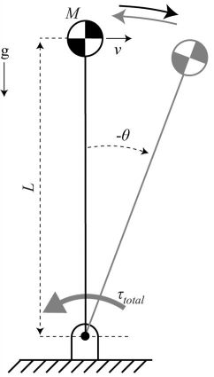

# Scaling of Inertial Delays in the Posture Task: Monte Carlo simulations for confidence intervals

## Description
This code conducts Monte Carlo simulations to determine the confidence intervals for the estimates of the scaling of Inertial Delay (perturbation response movement time) for the Posture Task. For a detailed description, please refer to this [publication](https://journals.plos.org/plosone/article?id=10.1371/journal.pone.0217188).

The posture task represents an animal that has been pushed forward in the sagittal plane and is trying to recover its posture under the control of its plantarflexor muscles. We modeled the posture task as an inverted pendulum actuated by a bang-bang controller. We obtained the mean and 95% confidence interval values for the following input parameters from literature: 
- Limb length
- Muscle mass
- Muscle length
- Muscle moment arm

We used Monte Carlo simulations to propagate the uncertainty in the input parameters (quantified by their confidence intervals) through to the output (the confidence intervals for the scaling of inertial delay).

## Instructions
The repository contains the following files: 
- GH_Master_MonteC_InvPendT1: This script loads the probability distributions for the input parameters, sets the number of simulations and perturbation size vector, and saves the final results. 
    - Set Niter to the number of Monte Carlo simulations you require (I used 10,000 for the publication). 
    - Set InitVal2 vector to contain the perturbation sizes to be tested in Froude number. 
    - Set graph=1/0 to switch graphs on or off. 
- GH_MonteC_InvPendT1: This function randomly samples from the probability distributions for the input parameters, and passed values to  GH_InvPendT1.m 
- GH_InvPendT1: Simulates the posture task. Halts the simulation when the pendulum reaches 0 velocity. Then optimizes the time to switch the direction of the bang-bang controller torque (Tswitch) using the fsolve optimizer (trust-region dogleg algorithm), to get the inverted pendulum to stop exactly at the vertical position.
- forelimbCIcalcv3.mat: Probability distributions for forelimb inertial properties from Kilbourne and Hoffman 2013. 
- hindlimbCIcalcv3.mat: Probability distributions for hindlimb inertial properties from Kilbourne and Hoffman 2013.
- InvPendT1-Froude_pert.mat: Dataset with results from Posture Task simulations considering only mean values. 

## References
- Thangal, S.N.M., Donelan, J.M., 2020. Scaling of inertial delays in terrestrial mammals. PLoS One 15, e0217188. https://doi.org/10.1371/journal.pone.0217188
- Kilbourne, B.M., Hoffman, L.C., 2013. Scale effects between body size and limb design in quadrupedal mammals. PLoS One 8, e78392.
- Alexander, R.M., Jayes, A.S., Maloiy, G.M.O., Wathuta, E.M., 1981. Allometry of the leg muscles of mammals. J. Zool. 194, 539–552. https://doi.org/10.1111/j.1469-7998.1981.tb04600.x
